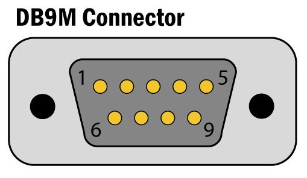

# AUX Connector Pinout

| # | Name         | Description                     |
| - | ------------ | ------------------------------- |
| 1 | NC           | Not Connected                   |
| 2 | RX           | Receive Data Line               |
| 3 | TX           | Transmit Data Line              |
| 4 | EXT-IN       | 5V Digital Input                |
| 5 | GND          | Ground                          |
| 6 | EXT-OUT      | 5V Digital Output               |
| 7 | BACKLGHT-OUT | PWM Backlight Output            |
| 8 | BACKLGHT-EN  | External Backlight Enable Input |