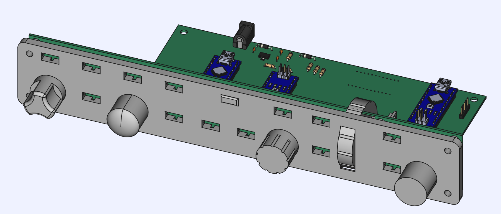
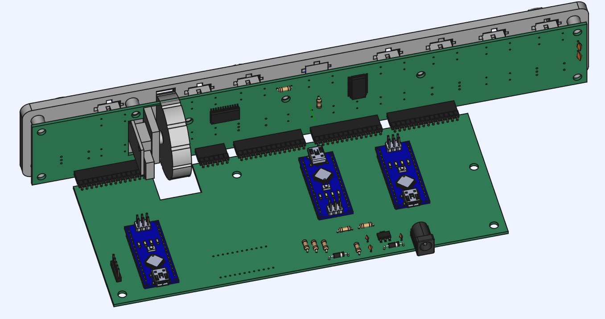
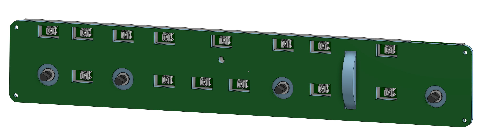
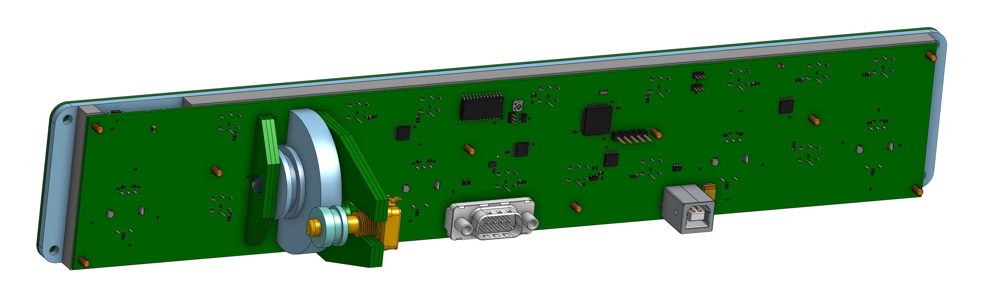

# GarminAutopilotController
Microsoft flight sim controller for the TBM-930 autopilot panel. Based on the Garmin GMC-710 Autopilot head unit. It's as dimensionally accurate as I can get based on the pictures and data I could find online. I dont have $1400 to spend on a real unit, so I did my best!

This was also my first electronics project and the progression in my knowledge and expertise is interesting so I've layed it out here.

# Version 1:

Its not bad... Well its actually crap. It was my first project though and I'm happy with it. It got me started down the electrical engineering and product design rabit hole. It was also a good starting point as a "Button-Box" is usually a nice and easy Arduino project to start on. With lots of possiblities for enhancement and features as you learn.

I was experimenting with inter-MCU communication and designing a multi-PCB project. It was alot harder when the tools I was using had no way to keep track of pinouts and getting all the PCBs into one CAD project was a nightmare. Although, I had alot of fun developing my own communication protocol and figuring out how to send numbers bigger than a byte! Ohh, and it didn't set itself on fire..

# Version 2:

Is lost somewhere. I might have it on a backup but it was barely worked on. The only evidence I have of it is the REV1 PCBs. I was based around the Arduino Due and was very similar to Version 1. It cut the multiple micros in favor of lots of IO. Except it was still based around the complete module. It was with this design that I looked into getting just the chips and programming them myself. However, I still wasnt confident enough to completely ditch the Arduino modules. Instead, I would use the arduino schematics and create my own layout using their schematics, then perform "brain surgery" to remove the chip from the module and re-solder it to my board.

# Version 3:

This is where I'm now. its based on the STM32 micro with a fully integrated and robust design. The schematics and PCB layout is all my own work. I also have much better tools! 

The overall design and features are the same but its something that could actually be manufactured. It's built around one PCB that handles everything. It's close to a single side load for the SMD components but I didn't put too much effort into making the PCB mass-producable. That's something im looking into for the next revision.

## Construction

It uses a PCB a the faceplate with cutouts for backlighting and laser-cut acrylics for the faceplate backing. As of this revision, the frame is still a 3D printed part. However, I'm hoping to make it out of 1 or 2 laser-cut peices in the near future. That would reduce the 3D printed parts down to just the small parts. (wheel, pulley, Buttons, and knobs.)

The mount for the wheel is made out of simple PCBs that are soldered together then fit and soldered on to the main PCB. This eliminates the need for a complicated frame that would have to be 3D printed or glued together. Its a remarkably sturdy system. If its sturdy enough, I'm going to convert the wheel to a gear-train instead of a belt. That should improve the feel and remove a large weakness in the design.

## Electronics

The main MCU is a STM32F070RBT6. It's good enough for the task at hand. Its a bit low on flash and RAM due to the USB stack on top of the firmware. It all fits though, so It's good enough. Theres just enough indicators for one STP16CP05 LED driver reducing pin count needs and keeps the brightness uniform across all the indicators.

The buttons are fancy with buit-in LEDs. One concern is sourcing these buttons. a future version might use a standard push-button with a discrete LED for backlighting. Further testing is needed so for now, fancy buttons.

The power consumption is low as well. Its all powered from USB and even at full brightness, theres no worry about running out of power from a standard USB 2.0 port.

It also has a DB-9 connector for external communication with a USART serial device and the other pins are used for auxiliary buttons or triggers. the data lines are the same but the control lines ARE NOT and are used for other things. [See the AUX Pinout Diagram for more.](./Docs/AuxPinoutDiagram.md)

[Here is the full Schematic](./Docs/GarminAutopilotREV3.pdf)

## Firmware & Software

Every indicator and brightness is fully controllable from the companion app and the simulator. [Go to the TBM Autopilot Companion App for more](https://github.com/Daxxn/TBMAutopilotInterface)

The options for things like max brightness, status indication, button and aux connector config is not complete at the moment. Most of the options are set up in the firmware but the protocol and companion app arent done yet.

## Protocol

The protocol is simple. Relying on the USB Serial COMM Port and a standard 115200 baud rate. In the future, I would like to create a custom HID interface and USB driver. I'm just not there yet. [The protocol is described here in more detail.](./Docs/SerialUSBProtocol.md)

[See the Full CAD Project Here](https://cad.onshape.com/documents/2cdb34bada5ac0e97f55ad1b/w/1d9a53a77bfbd00e7668fd50/e/991477143b7ac83eefeb1334?renderMode=0&uiState=6617a6e1f2ac6e5e4b32f398)

# Conclusion / Reasoning

 The one design requirement that is critical to this projects existence is the ability to get indicator information from the simulator. Every button has an indicator next to it that indicates the state of the autopilot. For me, this is critical when using it in-game and I don't like to only go half-way.
 
 
 
 The buttons and rotary encoders are easy, even the first version had all that working. The challenge has been getting the state of the autopilot from the sim. Its been an involved preocess thats documented in the [Autopilot Companion App.](https://github.com/Daxxn/TBMAutopilotInterface)